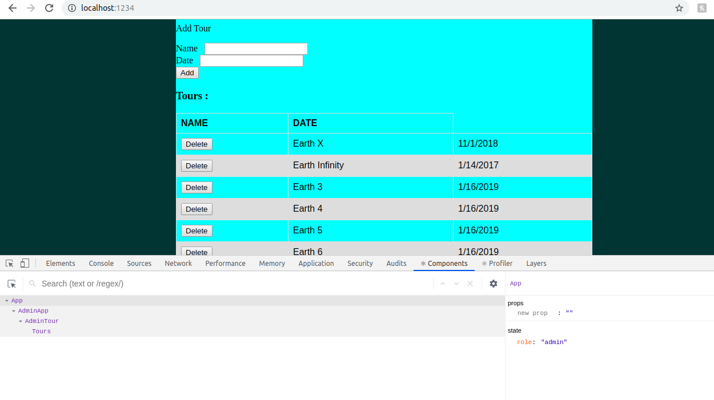
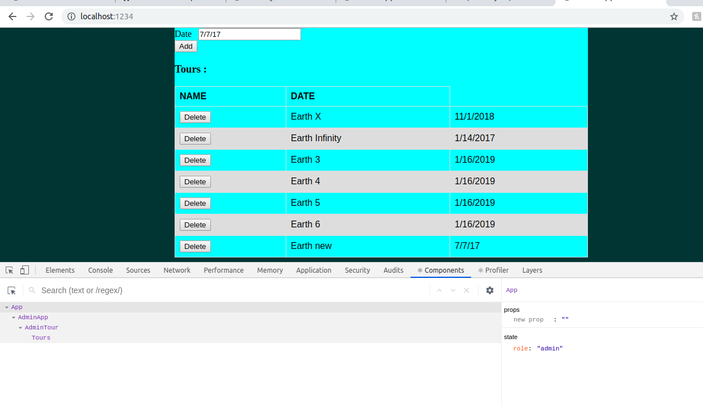

# Homework #4 Solution

**Sai Shethabhish Naidu Palla**

**NetID: xq4954**

# Question 1 (A) & (B)

# Question 1 (C)

Guest App

 
Admin App

Customer App

# Question 1 (D)

**Index.js Code**

		import React from "react";
	import ReactDOM from "react-dom";
	import { render } from "react-dom";
	import GuestApp  from "./components/GuestApp"
	import AdminApp  from "./components/AdminApp"
	import  CustomerApp  from "./components/CustomerApp"
	import img from "./multiverse.jpg";

	class App extends React.Component {
	constructor(props) {
	        super(props);
	        this.state = {role: "guest",show:"GuestApp"};
	  }

	render () {

	let contents = null;

	        switch (this.state.role) {

	            case "guest":
	                contents = <GuestApp> </GuestApp>;
	                break;
	            case "customer":
	                contents = <CustomerApp> </CustomerApp>;
	                break;
	            case "admin":
	                contents = <AdminApp> </AdminApp>;
	                break;
	            default:
	                contents = <GuestApp> </GuestApp>;
	        }

	return (

	

	    {contents}

	    
	    
The S.T.A.R Labs tours is a rescently established agency. But we take ypu to he places where other tours cannot take you.
				Yess, you guessed it right. We take you to the multiverse. Ever wondered going to another earth and maybe meet your doppleganger??
				At S.T.A.R Labs tour we make it possible. We take you to another earth where you can meet your doppleganger. Doesn't it sound cool and exciting meeting yourself in another universe?
				So why the wait? Signup quickly
				

	  

	);
	}
	}

	ReactDOM.render(
	   <App />,
	   document.getElementById("root")
	);

# Question 2 (A) & (B)

Guest Home State

**home.js**

	import React from "react";
	import img from "../multiverse.jpg";

	export class Home extends React.Component{

	constructor(props) {
	       super(props);
	       this.state = {
	        show: "home"};
	 }

	render(){
	return(

	

	<main>
	<h1> S.T.A.R Labs tours </h1>

	
	    
The S.T.A.R Labs tours is a rescently established agency. But we take ypu to he places where other tours cannot take you.
				Yess, you guessed it right. We take you to the multiverse. Ever wondered going to another earth and maybe meet your doppleganger??
				At S.T.A.R Labs tour we make it possible. We take you to another earth where you can meet your doppleganger. Doesn't it sound cool and exciting meeting yourself in another universe?
				So why the wait? Signup quickly
				

	</main>

	

	);
	}
	}

	export default Home;

Guest About State

**about.js**

	import React from "react";

	class About extends React.Component{

	constructor(props) {
	       super(props);
	       this.state = {
	        show: "about"};
	 }

	render(){
	return(

	

	<main>
	 
	 
	  
	<h1> About Us:</h1>

	<h1>S.T.A.R. LABS Tours</h1>
	

	Yess, you guessed it right. We take you to the multiverse. Ever wondered going to another earth and maybe meet your doppleganger??
				At S.T.A.R Labs tour we make it possible. We take you to another earth where you can meet your doppleganger. Doesn't it sound cool and exciting meeting yourself in another universe?
				So why the wait? Signup quickly.
	

	</main>

	 

	

	);
	}
	}

	export default About;

Guest Login State

**login.js**

	import React from "react";

	class Login extends React.Component{

	constructor(props) {
	       super(props);
	       this.state = {
	        show: "login"};
	 }

	render(){
	return(

	

	<main>
	 
	 
	  
	<h1> Login:</h1>

	<h1>Not Implemented Yet</h1>

	</main>

	 

	

	);
	}
	}

	export default Login;

# Question 3

A) Customer Tours State

B) Admin Customers State

# Question 4

A)

B)

**Index.js File Code**

	class App extends React.Component {
	    constructor(props) {
		super(props);
		this.state = {role: "guest",user: null}; // We will have "user" and "admin" roles too.
		this.handleLogin = this.handleLogin.bind(this);
		this.handleLogout = this.handleLogout.bind(this);
	    }

	    handleLogin(role, Info){
		if(role === "admin"){
		    this.setState({
		        role : "admin",
		        user: "Info",
		    })
		} else if(role === "customer"){
		    this.setState({
		        role : "customer",
		        user: "Info",
		    })
		}
	    }

**Login.js File Code**

	class Login extends React.Component {

	    constructor(props) {
		super(props);
		this.state = {role: "guest", email: null,password: null,};
		this.setEmail = this.setEmail.bind(this);
		this.setPassword = this.setPassword.bind(this);
		this.signIn = this.signIn.bind(this);

	    }

	    setEmail(event){
		this.setState({
		    email: event.target.value
		    //email: this.refs.email.value,
		});
	    }

	    setPassword(event){
		this.setState({
		    password: event.target.value
		    //password: this.refs.password.value,
		});
	    }

	    signIn() {
		if(this.state.email === "admin@email.org"){
		    console.log('admin');
		    this.props.OnSucces("admin",{name: "garima", netid: "mm6326"});
		}
		else if(this.state.email === "cust@email.org"){
		    console.log('customer');
		    this.props.OnSucces("customer",{name: "garima", netid: "mm6326"});
		}
		else {
		    console.log('guest');
		    this.props.OnSucces("guest",{});
		}
	    }

 C)

**Index.js File Code Snippet**

	 handleLogout(){
		this.setState({
		    role: "guest",
		    user: null,
		})
	    }

	return(
     	 

          {this.state.role === "guest" && (<GuestApp handleLogin = {this.handleLogin} />)}
          {this.state.role === "admin" && (<AdminApp handleLogout = {this.handleLogout}/>)}
          {this.state.role === "customer" && (<CustomerApp handleLogout = {this.handleLogout}/>)}
         

      	)

# Question 5

(a) Json file

	[{"Name": "Earth X",
	"Date": "/01/2/2019"},

	{"Name": "Earth Infinite",
	"Date": "/02/30/2019"},

	{"Name": "Earth Dead",
	"Date": "/05/21/2019"},

	{"Name": "Earth 2",
	"Date": "/08/15/2019"}]

(b)

js code

	import React from "react";
	import tours  from "../tours.json";
	import "./table .css";

	export class Tours extends React.Component{

	constructor(props) {
	        super(props);
	        this.state = {show: "tours"};
	  }

	render(){
	return(

	

	  <h1>Tours</h1>
	{tours.map((tourdetails, index) => {
	return 

	<tr>
	<th>Name</th>
	<th>Date</th>
	</tr>
	<table>
	<tr>
	<td>{tourdetails.Name}</td>
	<td>{tourdetails.Date}</td>
	</tr>

	</table>
	

	})}
	

	);
	}
	}

	export default Tours;
