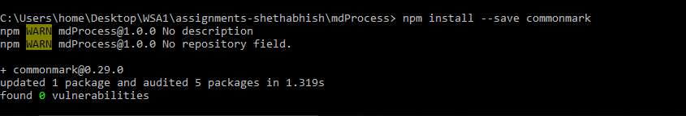
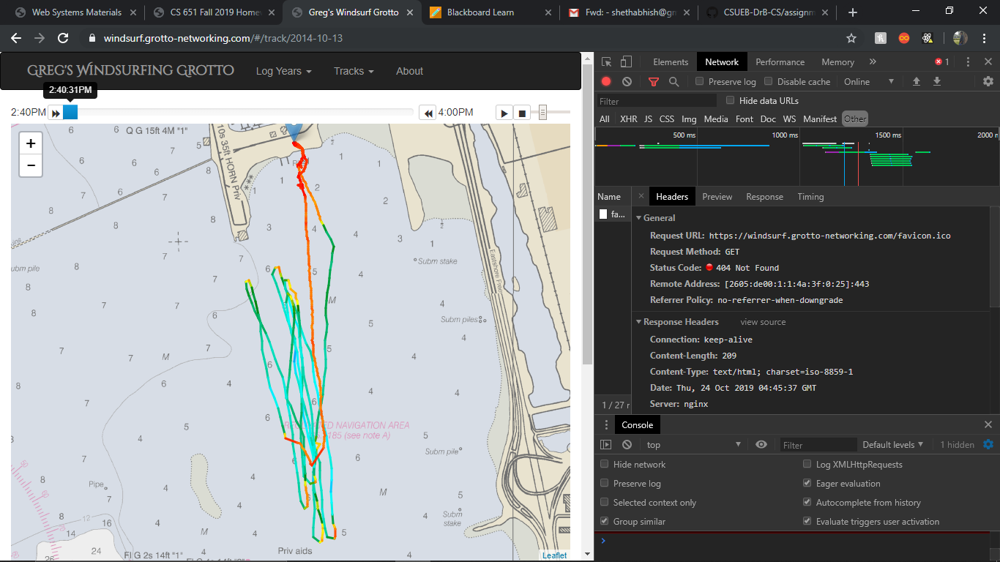
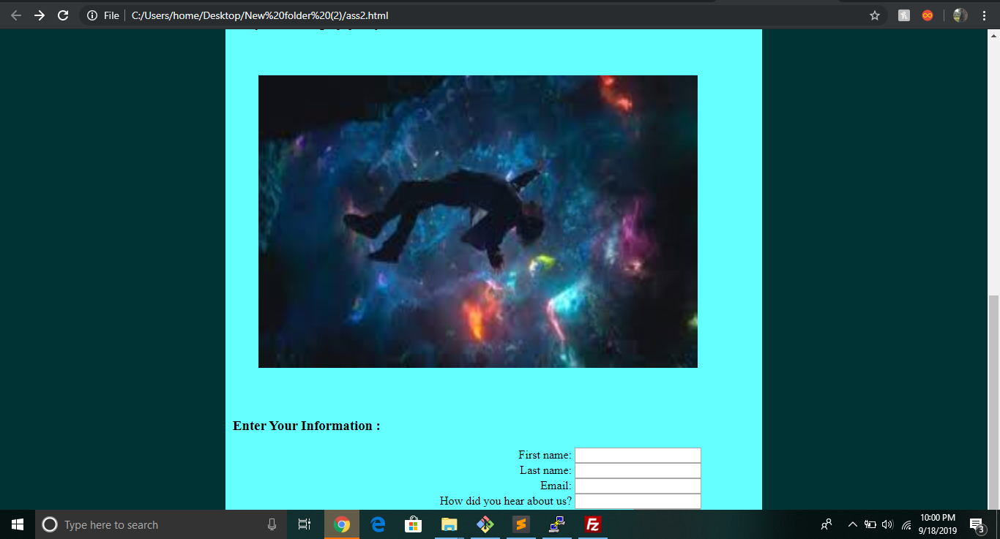
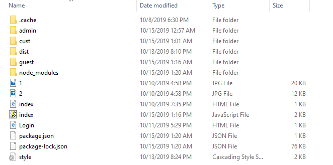

# Homework #2 Solution

**Sai Shethabhish Naidu Palla**

**NetID: xq4954**

# Question 1

# Question 2

# Question 3

(a)

(b) Javascript
    
    var pat = document.querySelectorAll(".patent")
    var patent_info = [];
    for(var i=0; i <ptn.length; i++)
    {
        pat_info = { PatNumber : ptn[i].children[0].textContent, Title : ptn[i].children[1].textContent, Date : ptn[i].children[3].textContent }
        patent_info.push(pat_info);
    }

# Question 4

(a) 

(b) 

# Queston 5

(a)

(b) 

