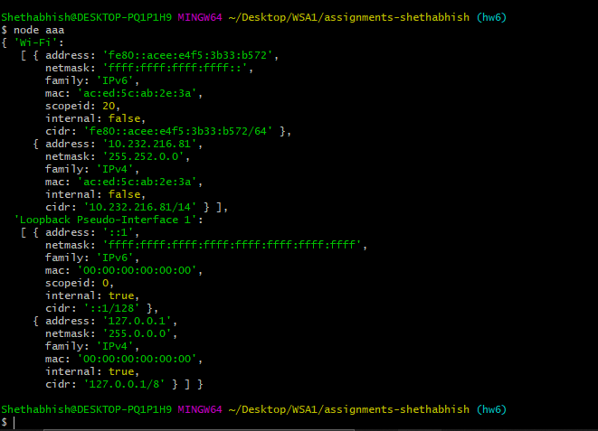
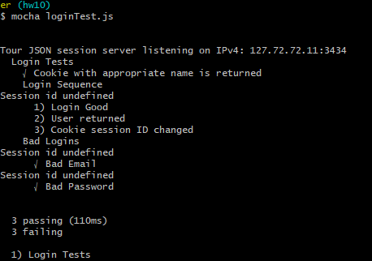

# Homework #9 Solution

**Sai Shethabhish Naidu Palla**

**NetID: xq4954**

# Question 1

(a) 

	const DataStore = require('nedb-promises');
	const db = new DataStore({filename: __dirname + '/userDB', autoload: true});
	const users = require('./usersTours.json');

	async function initialize() { // so I can await!
	    try {
	        let numRemoved = await db.remove({}, {multi: true});
	        console.log(`Cleanup, removed ${numRemoved} Data`);
	        let newDocs = await db.insert(users);
	        console.log(`Added ${newDocs.length} Data`);
	    } catch (err) {
	        console.log(`Database error: ${err}`);
	    }
	}

	initialize(); // don't forget to run the async function

(b) 

	const DataStore = require('nedb-promises');
	const db = new DataStore({filename: __dirname + '/toursDB', autoload: true});
	const tours = require('./Tours.json');
	async function initialize() { // so I can await!
	   try {
	       let numRemoved = await db.remove({}, {multi: true});
	       console.log(`Cleanup, removed ${numRemoved} Data`);
	       let newDocs = await db.insert(tours);
	       console.log(`Added ${newDocs.length} Data`);
	   } catch (err) {
	       console.log(`Database error: ${err}`);
	   }
	}

	initialize();

# Question 2

(a) 

	app.get('/tours' ,function(req, res) {

	db.find().then((docs)=>{
	console.log(`We found ${docs.length} documents`);
	console.log(docs);
	res.json(docs);
	});
	});

(b) 

	app.post('/addTour', checkAdminMiddleware, express.json(), function (req, res) {
	    var body = req.body;
	    tours.insert(body, function(newDocs) {

	    if(err)
	    {
	    console.log(`Error`);
	    console.log(err);
	    } else {

	    console.log(`Added ${newDocs.length} docs`);
	    }

	  });
	});

(c) 

	const rp = require('request-promise-native');

	let cookieJar = rp.jar();

	let site1 = {
	 uri: 'http://127.0.0.54:1613/tours/add',
	 method: 'POST', // What does this do?
	 body: {
	   "Name": "Kamchatka",
	   "Date": "6 Apr - 20 Apr"
	 },
	 json: true,
	 resolveWithFullResponse: true,
	 jar: cookieJar
	};

	let adminLogin = {
	 uri: 'http://127.0.0.54:1613/login',
	 method: 'POST', // What does this do?
	 body: {
	   "email": "sided1830@outlook.com",
	   "password": "C}m8\"L,F"
	 },
	 json: true,
	 resolveWithFullResponse: true,
	 jar: cookieJar
	}

	let customerLogin = {
	 uri: 'http://127.0.0.54:1613/login',
	 method: 'POST', // What does this do?
	 body: {
	   "email": "prolongating1890@yandex.com",
	   "password": "o)62USr5"
	 },
	 json: true,
	 resolveWithFullResponse: true,
	 jar: cookieJar
	}

	let getToursCount = {
	 uri: 'http://127.0.0.54:1613/count/tour',
	 method: 'GET',
	 json: true,
	 resolveWithFullResponse: true,
	 jar: cookieJar
	};

	let getTours = {
	 uri: 'http://127.0.0.54:1613/tours',
	 method: 'GET',
	 json: true,
	 resolveWithFullResponse: true,
	 jar: cookieJar
	};

	let logout = {
	 uri: 'http://127.0.0.54:1613/logout',
	 method: 'GET',
	 jar: cookieJar
	};

	async function test() {
	 console.log("Test 1: Admin Login, add tour");

	 var admin = await rp(adminLogin);
	 console.log("Admin login test result: ", admin.body);
	 console.log("After admin login, Cookies: ", cookieJar.getCookieString(site1.uri));

	 var toursCount = await rp(getToursCount);
	 console.log("Admin visit, number of tours : ", toursCount.body);

	 var addTour = await rp(site1);
	 toursCount = await rp(getToursCount);
	 console.log("Admin add tour test, number of tours: ", toursCount.body);

	 rp(logout);
	 var tourData = await rp(getTours);
	 console.log("After logout, Cookies : ", cookieJar.getCookieString(logout.uri));

	 console.log("\n\nTest 2 : Customer add tour");

	 var customer = await rp(customerLogin);
	 console.log("Customer login test result : ", customer.body);
	 console.log("After customer login, Cookies : ", cookieJar.getCookieString(customerLogin.uri));

	 toursCount = await rp(getToursCount);
	 console.log("Customer visit, number of tours : ", toursCount.body);
	 addTour = await rp(site1);
	 console.log("Customer add tour error : ", addTour.body);
	 rp(logout);

	 console.log("\n\nTest 3 : Guest add tour");
	 toursCount = await rp(getToursCount);
	 console.log("Guest visit, number of tours: ", toursCount.body);

	 tours = await rp(getTours);
	 console.log("After guest visit, Cookies: ", cookieJar.getCookieString(getTours.uri));
	 addTour = await rp(site1);
	 console.log("Guest add tour error: ", addTour.body);

	}

	test().catch(function (err) {
	 console.log(err);
	});

# Question 3

(a) 
code

	const cookieName = "xq4954"; // Session ID cookie name, use this to delete cookies too.
	app.use(session({
	  secret: 'This is secret key brought to you by Shethabhish!',
	  resave: false,
	  saveUninitialized: false,
	  name: cookieName, // Sets the name of the cookie used by the session middleware
	}));

	const setUpSessionMiddleware = function (req, res, next) {
	  console.log(`session object: ${JSON.stringify(req.session)}`);
	  console.log(`session id: ${req.session.id}`);
	  if (!req.session.user) {
	      req.session.user = {role: "guest"};
	  };
	   next();
	};

(b) 

(c) 

	app.post('/login',express.json(),function(req,res)

	       {
	           let arrayOfUser = {};
	           let email = req.body.email;
	           let password = req.body.password;

	           let errorMessage = {"error": true, "message": "User/Password error"};

	           for(let i=0; i< loginData.length; i++) {
	               if(loginData[i].email == email) {
	                   let verified = bcrypt.compareSync(password, loginData[i].password);
	                   if(verified) {
	                       arrayOfUser.firstName = loginData[i].firstName;
	                       arrayOfUser.lastName = loginData[i].lastName;
	                       arrayOfUser.email = loginData[i].email;
	                       arrayOfUser.role = loginData[i].role;
	                       res.send(`Good login Test result: ${JSON.stringify(arrayOfUser)}`)

	                       let oldInfo = req.session.user;
	                       req.session.regenerate(function (err) {
	                         if (err) {console.log(err);}
	                       let newUserInfo = Object.assign(oldInfo, errorMessage);
	                       // delete newUserInfo.passHash;
	                       req.session.user = newUserInfo;
	                       res.json(newUserInfo);
	                   });
	                   }
	                   else {
	                       res.send(`Bad password Login error: StatusCodeError: 401 = ${JSON.stringify(errorMessage)}`)
	                   }
	               }
	           }
	   res.send(`Bad email Login error: StatusCodeError: 401 = ${JSON.stringify(errorMessage)}`)
	  });

	(d) 

	app.get('/logout', function (req, res) {
	   let options = req.session.cookie;
	   req.session.destroy(function (err) {
	       if (err) {
	           console.log(err);
	       }
	       res.clearCookie(cookieName, options); // the cookie name and options
	       res.json({message: "Goodbye"});
	   })
	});

	(e) 

	

#Question 4

(a) 

	const express = require('express');
	const app = express();
	var bodyParser = require("body-parser");
	const bcrypt = require('bcryptjs');
	const fs = require('fs');
	var session = require('express-session');
	var cookieParser = require('cookie-parser');
	const Datastore = require('nedb-promises');
	let tourDB = new Datastore({ filename: './toursDB', autoload: true });
	let usersDB = new Datastore({ filename: './usersDB', autoload: true });
	var users = fs.readFileSync('../tourServer/userTourHash.json');

	app.use(cookieParser());
	app.use(express.json());
	app.use(express.urlencoded({ extended: false }));

	const cookieName = "np6987toursid";
	app.use(session({
	 secret: 'Shethabhish',
	 resave: false,
	 saveUninitialized: false,
	 name: cookieName
	}));

	const setUpSessionMiddleware = function (req, res, next) {
	 if (!req.session.user) {
	   req.session.user = { role: 'guest' };
	 }
	 next();
	}

	app.use(setUpSessionMiddleware);

	var getTours = async function (req, res) {
	 res.setHeader('Content-Type', 'application/json');
	 var toursData = await tourDB.find({});
	 console.log(`${JSON.stringify(toursData)}`);
	 console.log(`${JSON.stringify(toursData.length)}`);
	 res.json(toursData);
	}

	var getNumberOfTours = async function (req, res) {
	 res.setHeader('Content-Type', 'application/json');
	 var toursData = await tourDB.find({});
	 var toursCount = `${JSON.stringify(toursData.length)}`;

	res.json(toursCount);
	}

	var addTours = async function (req, res) {
	   
	   let tour = req.body;
	       
	   await tourDB.insert(tour);
	       
	   let tours = await tourDB.find({});
	   res.json(tours);
	       
	}

	var doLogin = async function (req, res) {
	 console.log("inside login");
	 var loginData = req.body;
	 var email = loginData.email;
	 var password = loginData.password;
	   console.log(password);
	 var errorData = {
	   "error": true,
	   "message": "User/Password error"
	 };
	 var user;
	 if (typeof (email) != "undefined" && typeof (password) != "undefined") {
	   let user = usersDB.find(function (user) {
	       return user.email === email
	   });
	   if (!user) {

	     res.json(JSON.stringify(errorData));
	   }
	   else {
	     console.log("else");
	       console.log(usersDB.password);
	   
	       if( email =="sided1830@outlook.com"){
	               console.log("inside");
	               req.session.user = {role: "admin"};
	           } else{
	               req.session.user = {role: "guest"};
	           }
	       var oldUserInfo = req.session.user;
	       req.session.regenerate(function (err) {
	         if (err) {
	             console.log("if err");
	           console.log(err);
	         }
	       
	         let newUserInfo = Object.assign(oldUserInfo, user);
	         delete newUserInfo.password;
	         req.session.user = newUserInfo;
	         console.log("Changing session.user when login : ", req.session.user);
	           
	         res.json(newUserInfo);
	       });
	   }
	 }
	 else {
	   resData = "Bad login data : StatusCodeError: 401 - " + JSON.stringify(errorData);
	 }
	}

	var doLogout = function (req, res) {
	 let options = req.session.cookie;
	 req.session.destroy(function (err) {
	   if (err) {
	     console.log(err);
	   }
	   res.clearCookie(cookieName, options);
	   res.json({ message: 'GoodBye' });
	 });
	}

	var checkAdmin = function (req, res, next) {
	 var err = { "error": "Not Permitted" };
	   console.log("Role:::::::");
	   console.log(req.session.user.role);
	 if (req.session.user.role !== "admin") {
	   var errString = "StatusCodeError: 401 - " + JSON.stringify(err);
	   res.json(errString);
	 }
	 else {
	   next();
	 }
	}

	var checkCustomer = function (req, res, next) {
	 var err = { "error": "Not Permitted" };
	 if (req.session.user.role !== 'customer') {s
	   var errString = "StatusCodeError: 401 - " + JSON.stringify(err);
	   res.json(errString);
	 }
	 else {
	   next();
	 }
	}

	app.get('/tours', getTours);
	app.get('/count/tour', getNumberOfTours);
	app.post('/tours/add',checkAdmin, express.json(), addTours);
	app.post('/login', express.json(), doLogin);
	app.get('/logout', doLogout);

	host = '127.0.0.54';
	port = '1613';
	app.listen(port, host, function () {
	 console.log(`TourServer listening on IPv4: ${host}:${port}`);
	});

	(b) 
