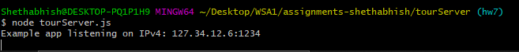
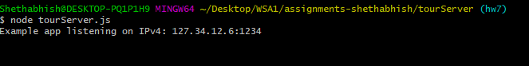

# Homework #7 Solution

**Sai Shethabhish Naidu Palla**

**NetID: xq4954**

# Question 1

(a) 

(i) The HTTP method used is GET

(ii) When a request is sent to a web server, it returns a 3 digit HTTP response status code, which will tell you what will happen. For example a code 200 mean OK.

(iii) The HTTP version that is being used is 1.1

(b) Request Headers

Provisional headers are shown
Referer: https://bb.csueastbay.edu/
Sec-Fetch-Mode: no-cors
User-Agent: Mozilla/5.0 (Windows NT 10.0; Win64; x64) AppleWebKit/537.36 (KHTML, like Gecko) Chrome/77.0.3865.120 Safari/537.36

(c) Response Headers

accept-ranges: bytes
age: 2801
content-length: 2407
content-type: image/vnd.microsoft.icon
date: Thu, 24 Oct 2019 02:31:38 GMT
etag: "145ed59c4833b97558db9794a1a71cbe"
last-modified: Thu, 26 Sep 2019 20:00:06 GMT
server: AmazonS3
status: 200
via: 1.1 bff12d4943c1f6f79b908f484a63c7f4.cloudfront.net (CloudFront)
x-amz-cf-id: ABgWONcrk7q84YBNrvYcE7f_PoFdU65Xs7hceYMhOeNTKnAiYT3qVA==
x-amz-cf-pop: SFO5-C1
x-amz-version-id: null
x-cache: Hit from cloudfront

(d)

(i) Blackboard is based on server openrestly/1.9.3.1

(ii) Yes, there are some cookies set, they are as follows:
Set-Cookie: BbRouter=expires:1571824268,id:3E09E81240E884CA933A79CDFB36C960,signature:f313534027ff408601e64da1316b3a256fff0bbe5e3305f2529d03d10b895e56,site:aefdf5db-8c6a-4e8e-8bf7-fb9f1f4dcdf0,timeout:10800,user:2ed36d0e9bc947799b425b1f759321cb,v:2,xsrf:24c2698a-f473-4da7-af75-c1a13dce61f1; Path=/; Secure; HttpOnly

(e)

(i) protocol :https 
domain: developer.mozilla.org
port: standard ports of the HTTPS 443
path: en-US/docs/Web/JavaScript/Guide/Grammar_and_Types<
query: - 
fragment: #Comments 

(ii) protocol :https 
domain: www.google.com
port :standard ports of the HTTPS 443
path: -
query: search?q=gaia+mission&rlz=1CYPO_enUS751
fragment: - 

(iii) protocol :http 
domain: 127.0.0.2:8282
port: standard ports of the HTTP 80
path:static/index.html
query: - 
Fragement: -

​
# Question 2

(a)

(b) 

(c)

# Question 3

(a)

(b) 

(c)

# Question 4

(a) 

(b)

