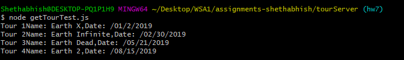
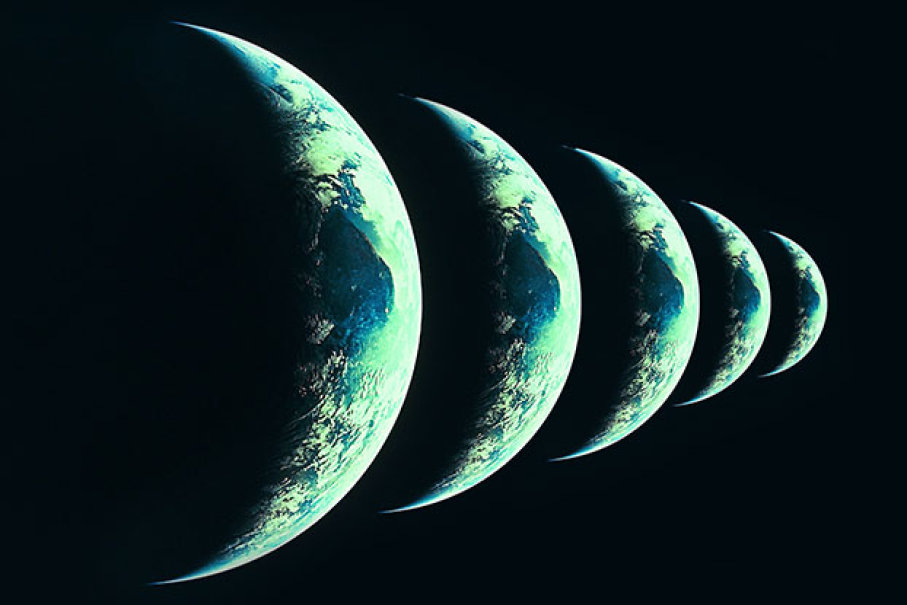
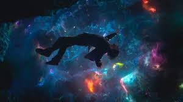
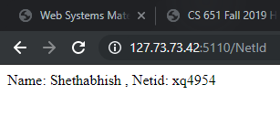
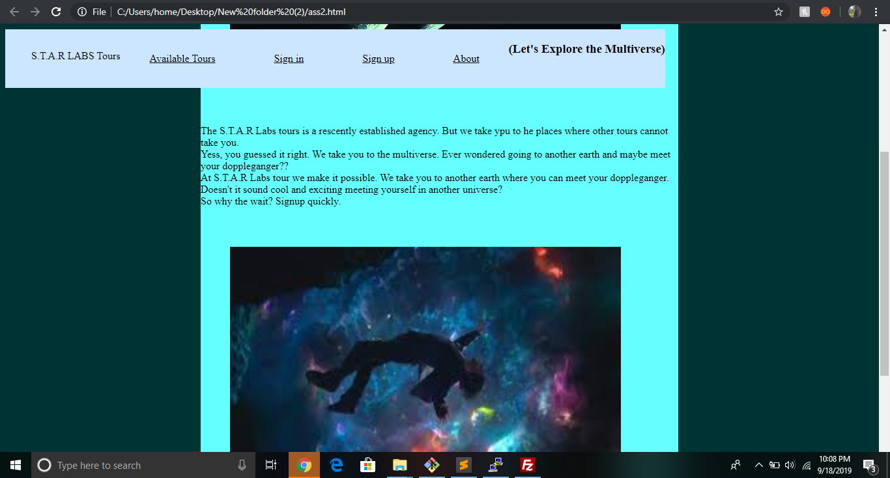
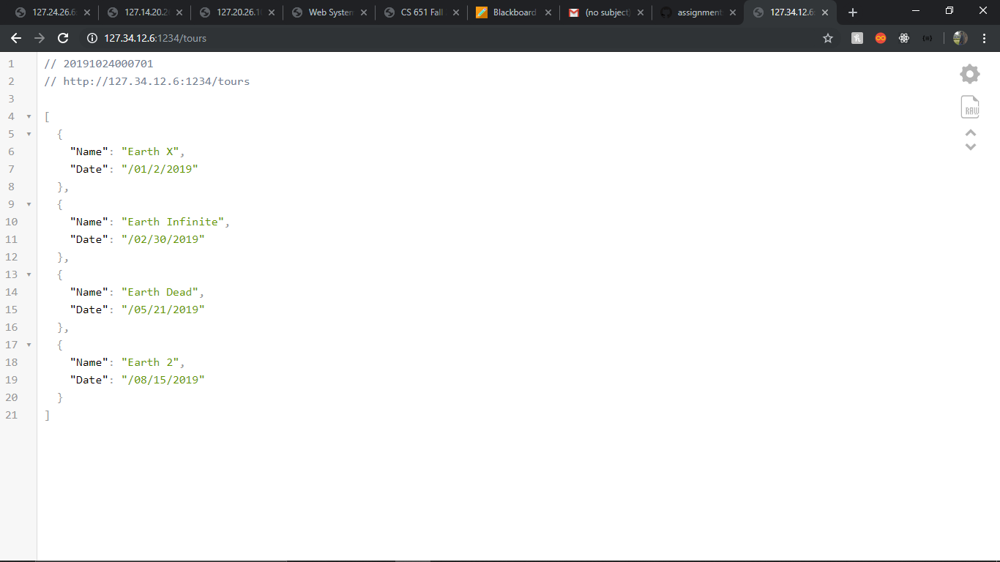

# Homework #3 Solution

**Sai Shethabhish Naidu Palla**

**NetID: xq4954**

# Question 1

 (a)
 

 **randomDrawing code**

	 <!DOCTYPE html>
		<html lang="en">
		<head>
		    <meta charset="utf-8">
		
		<title>Random Drawing</title>

		
	    	
	    	

	    	<link rel="stylesheet" href="drawing.css" />
		</head>

		<body>
		<h1>Random Drawing Fun!</h1>
	  	<h2>Brought to you by xq4954</h2>

		<svg id="circles" version ="1.1" baseProfile="full" height="800" width="800" xmlns="http://www.w3.org/2000/svg">
		</svg>
	    
		</body>
		</html>

**code of drawing**

	var mySVG = document.getElementById("circles");
	var maxSize = 50,
	maxX = 1000,
	maxY = 500;
	maxR = 170;

	function randomCircles() {
	let x = Math.random()*(maxX - maxSize);
	let y = Math.random()*(maxY - maxSize);
	let r = Math.random()*(maxR - maxSize);
	let width = Math.random()*maxSize;
	let circle = document.createElementNS("http://www.w3.org/2000/svg", "circle");
	circle.setAttribute("cx", x);
	circle.setAttribute("cy", y);
	circle.setAttribute("width", width);
	circle.setAttribute("height", width);
	circle.setAttribute("r", r*0.5);
	let colorStr = `rgb(${255*Math.random()}, ${255*Math.random()}, ${255*Math.random()})`;
	circle.setAttribute("fill", colorStr);
	circle.setAttribute("fill-opacity", 0.7);
	return circle;
	}
	for (let i = 0; i < 30; i++) {
	  mySVG.appendChild(randomCircles());
	}

(b)

**randomDrawing code** 

	<!DOCTYPE html>
	<html lang="en">

	<head>	
	    <meta charset="utf-8">
 
	    <title>Random Drawing</title>
	    
	    
	    

	    <link rel="stylesheet" href="drawing.css" />
	</head>

	<body>
    
	    <h1>Random Drawing Fun!</h1>

  		<h2>Brought to you by xq4954!</h2>

		<label for="circles">Number of Circles:</label>
		<input type="number" id="circles" name="circles" min="1" max="20">
		<input type="submit" name="submit">

		<label for="squares">Number of Squares:</label>
		<input type="number" id="squares" name="squares" min="1" max="20">
		<input type="submit" name="submit">
    
	</body>
	</html>

(c)

	<!DOCTYPE html>
	<html lang="en">

	<head>
	   <meta charset="utf-8">
	 
	   <title>Random Drawing</title>
	   
	   
	   

	   <link rel="stylesheet" href="drawing.css" />
	</head>

	<body>
	   
	   <h1>Random Drawing Fun!</h1>

	  <h2>Brought to you by xq4954!</h2>

	<label for="circles">Number of Circles:</label>
	<input type="number" id="circles" name="circles" min="1" max="20">
	<button id="myBtn1">Submit</button>

	<label for="squares">Number of Squares:</label>
	<input type="number" id="squares" name="squares" min="1" max="20">
	<button id="myBtn2">Submit</button>
	   
	</body>
	</html>

	**js code**

	var mySVG = document.getElementById("circles");
	var maxSize = 50,
	maxX = 1000,
	maxY = 500;
	maxR = 170;

	var mySVG = document.getElementById("squares");
	var maxSize = 50,
	maxX = 500,
	maxY = 300;

	function randomCircles(){
	let x = Math.random()*(maxX - maxSize);
	let y = Math.random()*(maxY - maxSize);
	let r = Math.random()*(maxR - maxSize);
	let width = Math.random()*maxSize;
	let circle = document.createElementNS("http://www.w3.org/2000/svg", "circle");
	circle.setAttribute("cx", x);
	circle.setAttribute("cy", y);
	circle.setAttribute("width", width);
	circle.setAttribute("height", width);
	circle.setAttribute("r", r*0.5);
	let colorStr = `rgb(${255*Math.random()}, ${255*Math.random()}, ${255*Math.random()})`;
	circle.setAttribute("fill", colorStr);
	circle.setAttribute("fill-opacity", 0.7);
	return circle;
	}

	function randomSquare() {
	 let x = Math.random()*(maxX - maxSize);
	 let y = Math.random()*(maxY - maxSize);
	 let width = Math.random()*maxSize;
	 let square = document.createElementNS("http://www.w3.org/2000/svg", "rect");
	 square.setAttribute("x", x);
	 square.setAttribute("y", y);
	 square.setAttribute("width", width);
	 square.setAttribute("height", width);
	 let colorStr = `rgb(${255*Math.random()}, ${255*Math.random()}, ${255*Math.random()})`;
	 square.setAttribute("fill", colorStr);
	 square.setAttribute("fill-opacity", 0.7);
	 return square;
	}

	document.getElementById("myBtn1").addEventListener("click", function(){
	document.getElementById("circles").innerHTML = randomCircles()}
	document.getElementById("myBtn2").addEventListener("click", function(){
	document.getElementById("squares").innerHTML = randomSquare()}

	for (let i = 0; i < 30; i++) {
	 mySVG.appendChild(randomCircles());
	}
	for (let i = 0; i < 30; i++) {
	 mySVG.appendChild(randomSquare());
	}

# Question 2

(a)

"HTML code"

	<!DOCTYPE html>
	<html lang="en">

	<head>
	   <meta charset="utf-8">
	 
	   <title>Random Drawing</title>
	   
	   
	   

	   <link rel="stylesheet" href="drawing.css" />
	</head>

	<body>
	   
	   <h1>Random Drawing Fun!</h1>

	  <h2>Brought to you by xq4954!</h2>

	<label for="circles">Number of Circles:</label>
	<input type="number" id="circles" name="circles" min="1" max="20">
	<button id="myBtn1">Submit</button>

	<label for="squares">Number of Squares:</label>
	<input type="number" id="squares" name="squares" min="1" max="20">
	<button id="myBtn2">Submit</button>
	<button id = 'remove'>Remove</button>
	</body>
	</html>

"js code"

	var mySVG = document.getElementById("circles");
	var maxSize = 50,
	maxX = 1000,
	maxY = 500;
	maxR = 170;

	var mySVG = document.getElementById("squares");
	var maxSize = 50,
	maxX = 500,
	maxY = 300;

	function randomCircles(){
	let x = Math.random()*(maxX - maxSize);
	let y = Math.random()*(maxY - maxSize);
	let r = Math.random()*(maxR - maxSize);
	let width = Math.random()*maxSize;
	let circle = document.createElementNS("http://www.w3.org/2000/svg", "circle");
	circle.setAttribute("cx", x);
	circle.setAttribute("cy", y);
	circle.setAttribute("width", width);
	circle.setAttribute("height", width);
	circle.setAttribute("r", r*0.5);
	let colorStr = `rgb(${255*Math.random()}, ${255*Math.random()}, ${255*Math.random()})`;
	circle.setAttribute("fill", colorStr);
	circle.setAttribute("fill-opacity", 0.7);
	return circle;
	}

	function randomSquare() {
	 let x = Math.random()*(maxX - maxSize);
	 let y = Math.random()*(maxY - maxSize);
	 let width = Math.random()*maxSize;
	 let square = document.createElementNS("http://www.w3.org/2000/svg", "rect");
	 square.setAttribute("x", x);
	 square.setAttribute("y", y);
	 square.setAttribute("width", width);
	 square.setAttribute("height", width);
	 let colorStr = `rgb(${255*Math.random()}, ${255*Math.random()}, ${255*Math.random()})`;
	 square.setAttribute("fill", colorStr);
	 square.setAttribute("fill-opacity", 0.7);
	 return square;
	}

	document.getElementById("myBtn1").addEventListener("click", function(){
	document.getElementById("circles").innerHTML = randomCircles()}
	document.getElementById("myBtn2").addEventListener("click", function(){
	document.getElementById("squares").innerHTML = randomSquare()}

	for (let i = 0; i < 30; i++) {
	 mySVG.appendChild(randomCircles());
	}
	for (let i = 0; i < 30; i++) {
	 mySVG.appendChild(randomSquare());
	}

# Question 4
(a) and (b)

"Html code"

	<!doctype html>
	<html>

	<head>

	<title>Signup</title> 
	<link rel="stylesheet" href="ass2.css">

	</head>

	<body>
		
		<nav>

			<ul>
				<li>
S.T.A.R LABS Tours
</li>
				<li><a class="button" href="www.google.com">Available Tours</a></li>
				<li><a class="button" href="www.google.com">Sign in</a></li>
				<li><a class="button" href="www.google.com">Sign up </a></li>
				<li><a class="button" href="www.google.com">About</a></li>
			</ul>

			<h3>(Let's Explore the Multiverse)</h3>

		</nav>

		<main>
				
			
			
The S.T.A.R Labs tours is a rescently established agency. But we take ypu to he places where other tours cannot take you. 
				Yess, you guessed it right. We take you to the multiverse. Ever wondered going to another earth and maybe meet your doppleganger?? 
				At S.T.A.R Labs tour we make it possible. We take you to another earth where you can meet your doppleganger. Doesn't it sound cool and exciting meeting yourself in another universe? 
				So why the wait? Signup quickly.
			

			

			<h3 style="padding-left: 10px;">Enter Your Information : </h3>

		

		<form>
			
	First name:
				<input type="text" name="firstname">

				
Last name:
				<input type="text" name="lastname">

				
Email:
				<input type="email" name="email">

				
How did you hear about us?
				<input type="text" name="temp">

				
<button style="text-align: left; padding-left: 10px;">Sign me Up!</button>

		</form>
	

		</main>
	</body>

	</html>

"CSS code"

	.container{
	    display: grid;
	    grid-template-columns: 650px;
	    text-align: right;
	    padding-bottom: 10px;
	    grid-gap: 20px;
	    }

(c) **Navbar**

**CSS code**

	nav{
		  background-color: black;
		  color: white;
		  display: flex;
		  position: fixed;
		}

# Question 5

(a)

