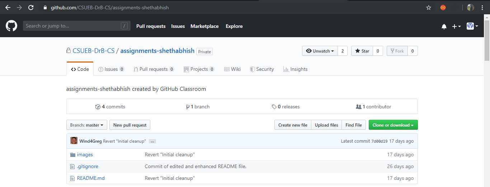
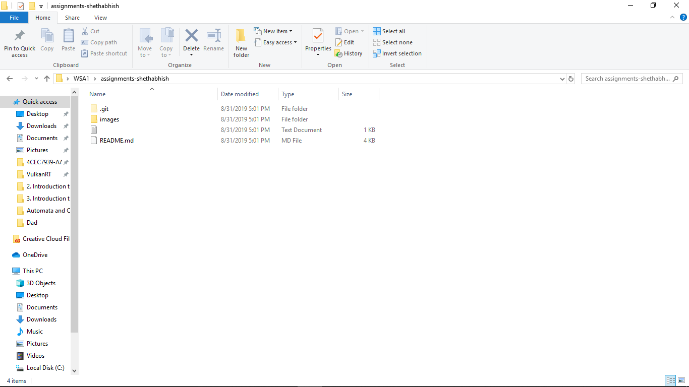
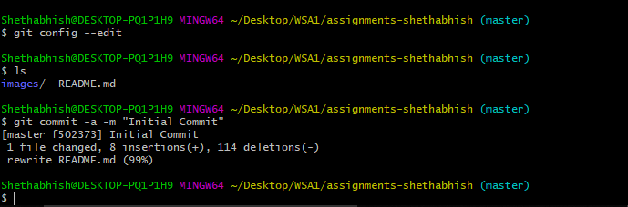
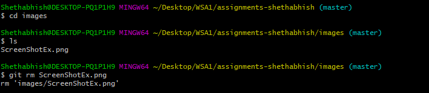
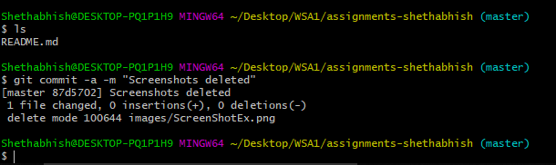
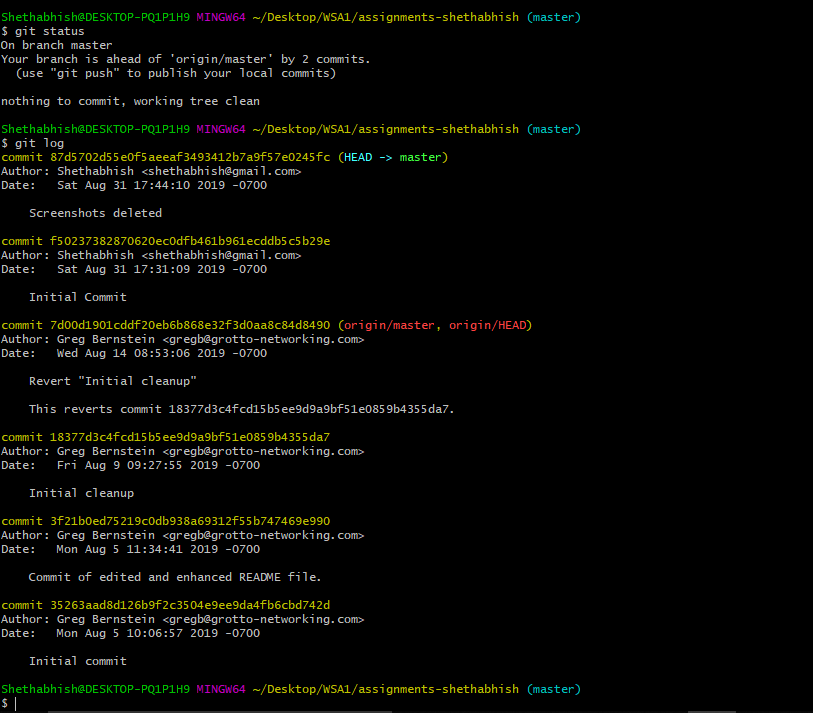
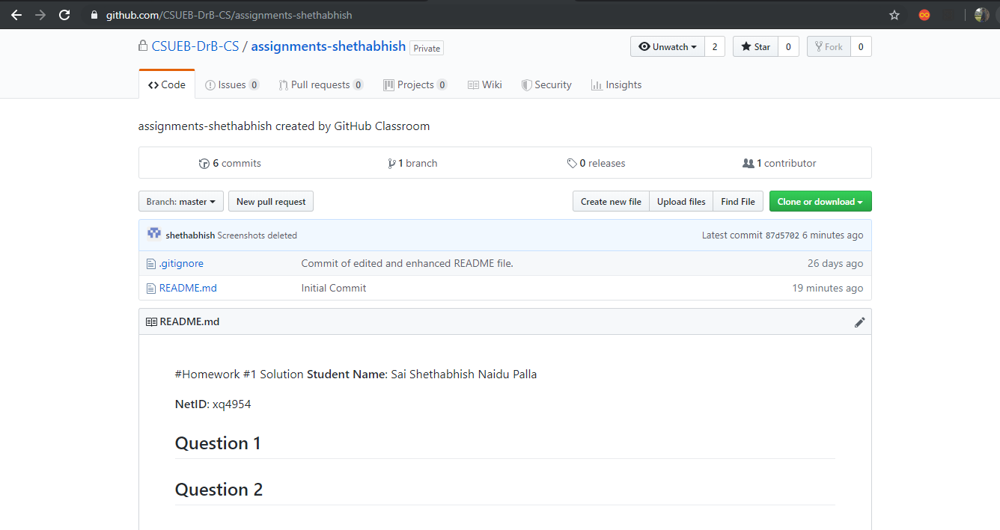

#Homework #1 Solution
**Student Name**:  Sai Shethabhish Naidu Palla

**NetID**: xq4954

## Question 1
## (a)
Repository 

## (b)
Clone 

## Question 2
## (a)
Readme Changes 

##(b)
Screenshot deletion1 
Screenshot deletion2 
Status and log 

##(c)
Pushed to github 

## Question 3

