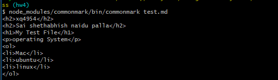
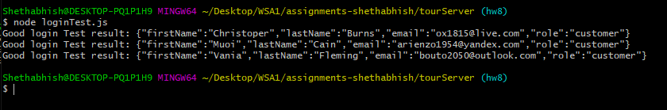
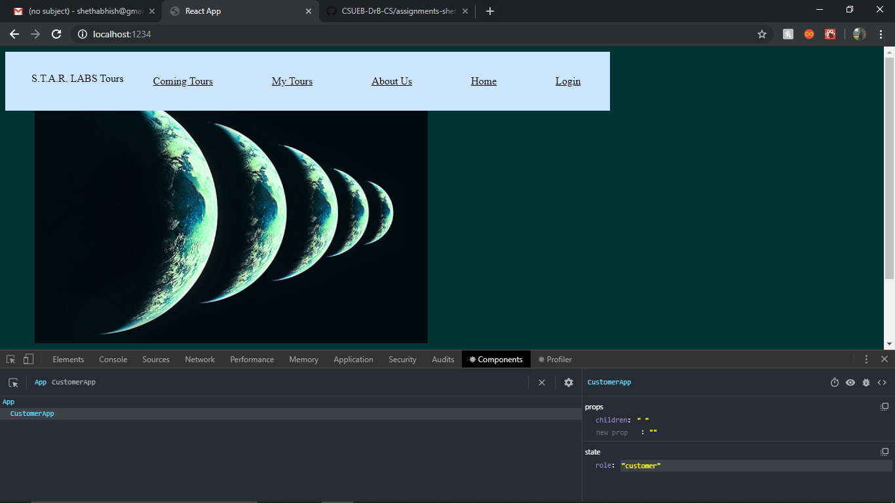
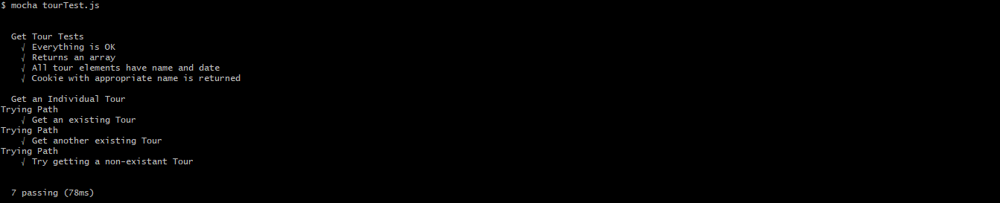
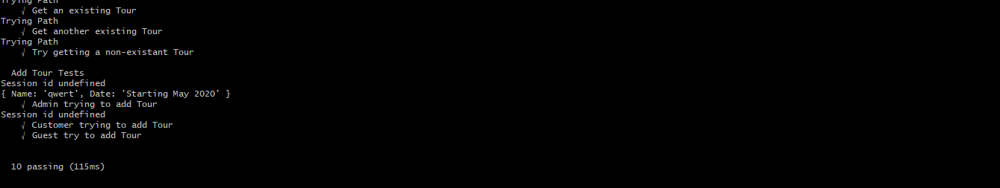
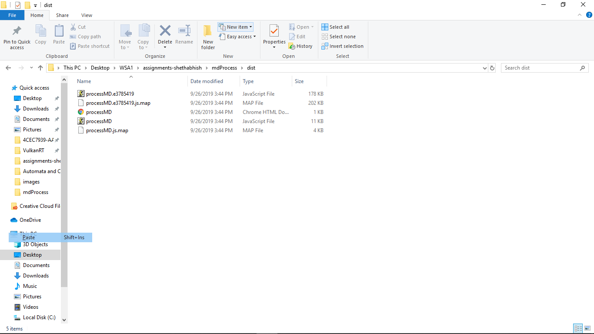

# Homework #4 Solution

**Sai Shethabhish Naidu Palla**

**NetID: xq4954**

# Question 1
(a)

Nodejs version: v10.16.3

NPM version: 6.9.0

(d)

# Question 2

(a&b)

(c)

# Question 3

(a)

(b)

**ProcessMD.js File**

		import commonmark from "commonmark";

		let output1=document.getElementById("output");
		let btn1=document.getElementById("btn");

		var reader = new commonmark.Parser();
		var writer = new commonmark.HtmlRenderer();

		function parser1() {

			let input1=document.getElementById("input");
		  	var parsed = reader.parse(input1.value);
		  	var result = writer.render(parsed); 

		  	console.log(result);
		  	output1.innerHTML=result;
		}

		btn1.addEventListener("click",parser1);

# Question 4

(a & b)

**ProcessMD.js File**

		import commonmark from "commonmark";
		import hljs from 'highlight.js';
		import 'highlight.js/styles/idea.css'

		let output1=document.getElementById("output");
		let btn1=document.getElementById("btn");

		var reader = new commonmark.Parser();
		var writer = new commonmark.HtmlRenderer();

		function parser1() {

			let input1=document.getElementById("input");
		  	var parsed = reader.parse(input1.value);
		  	var result = writer.render(parsed); 

		  	console.log(result);
		  	output1.innerHTML=result;

		  	document.querySelectorAll('pre code').forEach(block) = {
		  		hljs.highlightBlock(block);
		  	};
		}

		btn1.addEventListener("click",parser1);

(d)

 JavaScript file size : 1.2 MB

 CSS file size: 1.4 kb

# Question 5

(a)

**index.js file code**

		import React from "react";
		import ReactDOM from "react-dom";
		import chemElements from "./elements.json";

		// var test = this.getJSON("elements.json");
		// var jsontest = JSON.parse(test);
		// console.log(jsontest);

		// var data = JSON.parse();
		// console.log(data);
		// What is this? HTML mixed with JavaScript
		const element = (
		

		<h1>The Periodic Table</h1>
		<h2>Brought to you by Gayatri and net id uh3536 </h2>
		<h3>There are 118 chemical elements</h3>
		
);
		ReactDOM.render(
		    element,
		    document.getElementById("root")
		);

